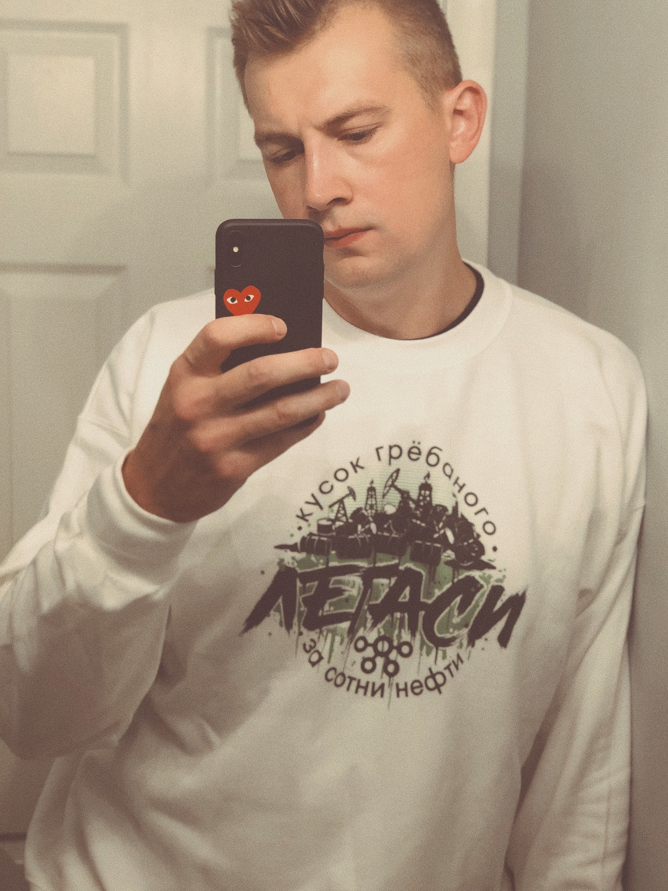

= Кусок (гр)ёбаного легаси за сотни нефти

== Что это?

Дерзкий дизайн для футболок и худи.
Описывает состояние корпоративного IT, где решения о покупке ПО основывается на таланте убеждать всяких маркетологов, которых только интересует тщеславие. 

._Откуда это вообще?_
[quote, Евгений Тимочкин, https://t.me/razbor_poletov_chat/115227[Телеграм-чат «Разбор Полетов»] ]
вот смотрите, @gamussa Витя, он успешен, у Вити есть opensource проекты? вот и я не видел ... Я не искал правда, если они есть, Витя, прости, дай ссылок. (Дебаты тут ранее про однозвёздночные репы на гитхабе не в счёт)У меня их тоже нет, но я не пытаюсь рассказать людям, как надо покупать кусок ебаного легаси за сотни нефти. Витя привых пиздежом зарабатывать. Это не упрёк, пиздеть тоже надо уметь. 

image::images/screenshot.png[]

== Кто сделал?

Коллаб между https://www.instagram.com/alexshimanov/[alexshimanov] и  https://www.instagram.com/gamussa[gamussa]

== А можно я себе напечатаю?

Конечно, вектор лежит в `eps` и `pdf`.

== А сколько стоит?

Бесплатно, т.е. даром.
Но вы можете задонатить на Paypay или Venmo `viktor dot gamov at gmail.com`

